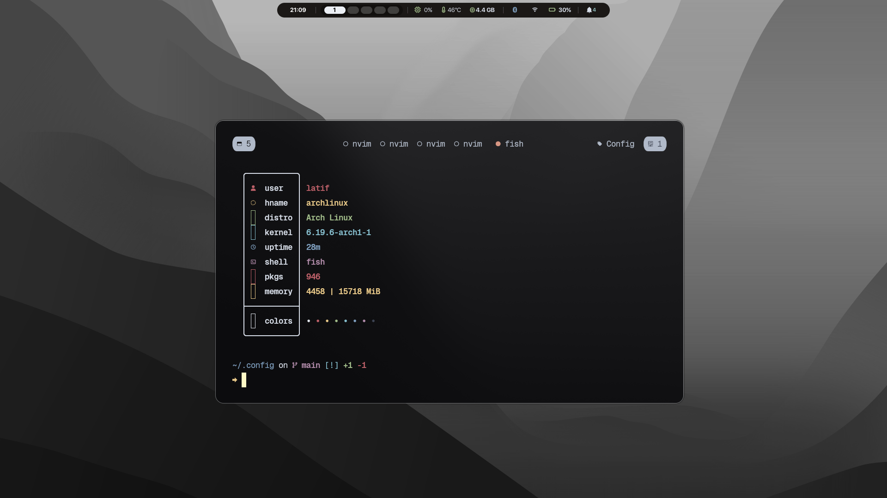
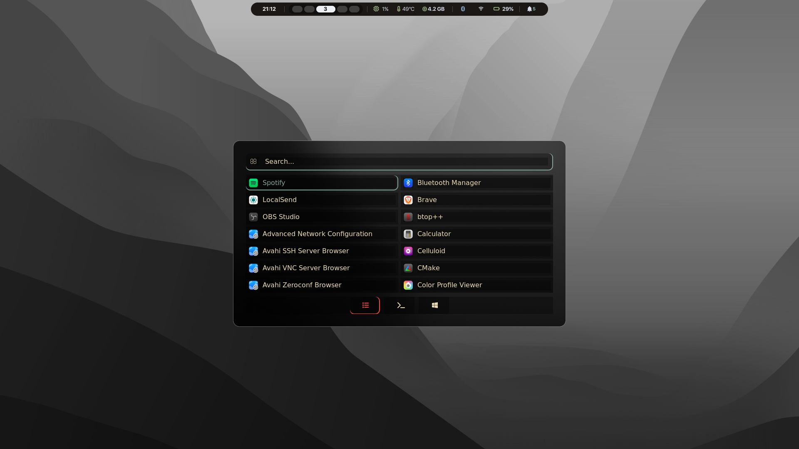
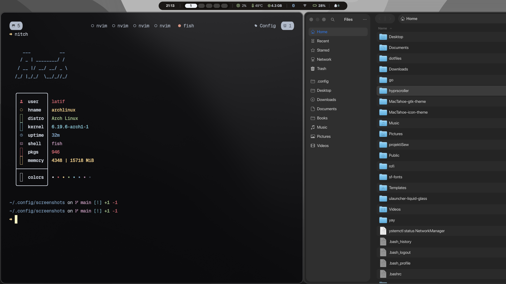
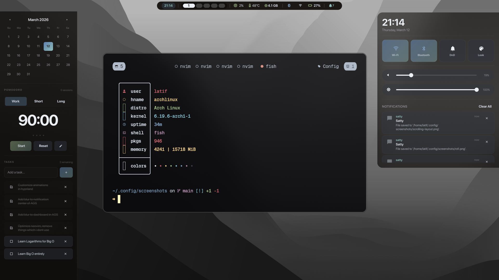

# Hyprland Dotfiles

My personal Hyprland configuration for Arch Linux with a focus on aesthetics and productivity.

## 📸 Screenshots

### Desktop Overview



### Application Launcher (Rofi)



### Scrolling Layout in Action



### AGS Bar & Dashboard



_Replace these with your actual screenshots once you've added them to the `screenshots/` directory_

## ✨ Features

- **Window Manager**: Hyprland 0.54+ with native scrolling layout
- **Status Bar**: AGS (Aylur's Gtk Shell)
- **Application Launcher**: Rofi (Wayland fork)
- **Terminal**: Kitty
- **Browser**: Brave
- **File Manager**: Nautilus
- **Screenshot Tool**: Grim + Slurp + Satty
- **Clipboard Manager**: Cliphist
- **Idle Manager**: Hypridle
- **Lock Screen**: Hyprlock
- **Logout Menu**: Wlogout
- **Wallpaper**: Swaybg
- **Night Light**: Wlsunset
- **Notifications**: AGS notification center

## 🎨 Theme

- **Blur Effects**: Frosted glass aesthetic with layered blur
- **Animations**: Smooth bezier curve animations
- **Border Rounding**: 17px rounded corners
- **Color Scheme**: Custom with accent colors
- **Cursor**: macOS cursor theme

## 📋 Prerequisites

### Required Packages

```bash
# Hyprland and core components
sudo pacman -S hyprland kitty nautilus

# Wayland utilities
sudo pacman -S grim slurp wl-clipboard wlsunset swaybg

# Audio and brightness control
sudo pacman -S wireplumber brightnessctl playerctl

# Fonts (add your preferred fonts)
sudo pacman -S ttf-font-awesome noto-fonts noto-fonts-emoji

# AUR packages (using yay or paru)
yay -S ags rofi-lbonn-wayland-git cliphist hypridle-git hyprlock satty
```

### Optional Packages

```bash
# Office suite
yay -S onlyoffice-bin

# Additional tools
sudo pacman -S polkit-gnome
```

## 🚀 Installation

1. **Clone the repository**

   ```bash
   git clone https://github.com/LatifKovani/dotfiles.git
   cd dotfiles
   ```

2. **Backup your existing configs** (if any)

   ```bash
   mv ~/.config/hypr ~/.config/hypr.backup
   mv ~/.config/ags ~/.config/ags.backup
   mv ~/.config/kitty ~/.config/kitty.backup
   # ... backup other configs as needed
   ```

3. **Copy configurations**

   ```bash
   # Hyprland
   cp -r hypr ~/.config/

   # AGS
   cp -r ags ~/.config/

   # Kitty
   cp -r kitty ~/.config/

   # Other configs
   cp -r waybar ~/.config/  # if applicable
   # ... copy other configs
   ```

4. **Make scripts executable**

   ```bash
   chmod +x ~/.config/hypr/xdg-portal-hyprland
   chmod +x /usr/local/bin/hp-camera-fix.sh  # if applicable
   chmod +x ~/.local/bin/toggle-wlsunset.fish
   ```

5. **Install custom scripts** (if any)
   ```bash
   # Copy your custom scripts to ~/.local/bin/
   mkdir -p ~/.local/bin
   cp scripts/* ~/.local/bin/
   ```

## ⌨️ Keybindings

### General

| Keybind             | Action                       |
| ------------------- | ---------------------------- |
| `SUPER + Q`         | Open terminal (Kitty)        |
| `SUPER + F`         | Open file manager (Nautilus) |
| `SUPER + B`         | Open browser (Brave)         |
| `SUPER + SPACE`     | Application launcher (Rofi)  |
| `SUPER + O`         | Office suite                 |
| `SUPER + M`         | Logout menu                  |
| `SUPER + SHIFT + M` | Exit Hyprland                |
| `SUPER + SHIFT + X` | Force kill active window     |
| `SUPER + SHIFT + U` | Lock screen                  |
| `SUPER + V`         | Toggle floating              |

### Screenshots

| Keybind     | Action            |
| ----------- | ----------------- |
| `SUPER + S` | Screenshot area   |
| `SUPER + W` | Screenshot window |

### Window Management (Scrolling Layout)

| Keybind                   | Action                          |
| ------------------------- | ------------------------------- |
| `SUPER + H/J/K/L`         | Move focus (left/down/up/right) |
| `SUPER + SHIFT + H/J/K/L` | Swap window                     |
| `SUPER + Period`          | Move to next column             |
| `SUPER + Comma`           | Move to previous column         |
| `SUPER + Equal`           | Increase column width           |
| `SUPER + Minus`           | Decrease column width           |
| `SUPER + SHIFT + Period`  | Swap column right               |
| `SUPER + SHIFT + Comma`   | Swap column left                |
| `SUPER + SHIFT + F`       | Fit active column to screen     |

### Workspaces

| Keybind                 | Action                        |
| ----------------------- | ----------------------------- |
| `SUPER + 1-9,0`         | Switch to workspace 1-10      |
| `SUPER + SHIFT + 1-9,0` | Move window to workspace 1-10 |
| `CTRL + 1,2`            | Move column to workspace 1,2  |

### System

| Keybind             | Action              |
| ------------------- | ------------------- |
| `SUPER + N`         | Toggle night mode   |
| `SUPER + R`         | Notification center |
| `SUPER + D`         | Dashboard           |
| `SUPER + C`         | Clipboard history   |
| `SUPER + SHIFT + C` | Clear clipboard     |

### Media Controls

| Keybind                 | Action             |
| ----------------------- | ------------------ |
| `XF86AudioRaiseVolume`  | Volume up 5%       |
| `XF86AudioLowerVolume`  | Volume down 5%     |
| `XF86AudioMute`         | Toggle mute        |
| `XF86AudioMicMute`      | Toggle mic mute    |
| `XF86MonBrightnessUp`   | Brightness up 5%   |
| `XF86MonBrightnessDown` | Brightness down 5% |
| `XF86AudioPlay`         | Play/pause         |
| `XF86AudioNext`         | Next track         |
| `XF86AudioPrev`         | Previous track     |

## 🎯 Scrolling Layout

This config uses Hyprland's native **scrolling layout** (migrated from hyprscrolling plugin in v0.54.0).

### Features

- Column-based window management
- Configurable column widths (0.5, 0.67, 0.8, 1.0)
- Default column width: 60%
- Focus follows mouse with smooth column transitions
- Fullscreen mode when only one column is present

### Configuration

```conf
scrolling {
    column_width = 0.6
    fullscreen_on_one_column = true
    explicit_column_widths = 0.5, 0.67, 0.8, 1.0
    follow_focus = true
    focus_fit_method = 1
    follow_min_visible = 0
}
```

## 🔧 Customization

### Changing Wallpaper

Edit `~/.config/hypr/hyprland.conf`:

```conf
exec = swaybg -m fill -i /path/to/your/wallpaper.png
```

### Adjusting Blur

Edit blur settings in `~/.config/hypr/hyprland.conf`:

```conf
decoration {
    blur {
        size = 12        # Blur radius
        passes = 3       # Number of blur passes
        contrast = 2     # Contrast adjustment
        brightness = 0.8 # Brightness adjustment
    }
}
```

### Modifying Gaps and Borders

```conf
general {
    gaps_in = 2           # Inner gaps
    gaps_out = 5 0 0 0    # Outer gaps (top, right, bottom, left)
    border_size = 1       # Border width
    col.active_border = rgba(ECEFF460)    # Active border color
    col.inactive_border = rgba(595959aa)  # Inactive border color
}
```

### Night Light Location

Update your coordinates in `~/.config/hypr/hyprland.conf`:

```conf
exec-once = wlsunset -l YOUR_LATITUDE -L YOUR_LONGITUDE -t 3700
```

## 🐛 Troubleshooting

### Scrolling layout not working

Make sure you're on Hyprland 0.54.0 or later:

```bash
hyprctl version
```

If using the old hyprscrolling plugin, disable it:

```bash
hyprpm disable hyprscrolling
hyprctl reload
```

### Blur not working

Ensure blur is enabled in decoration settings and `ignore_opacity` is set correctly.

### AGS not starting

Check AGS logs:

```bash
ags quit
ags run ~/.config/ags/bar/app.ts
```

### Rofi not appearing

Check if rofi-lbonn-wayland is installed:

```bash
rofi -version
```

If issues persist, try running rofi directly:

```bash
rofi -show drun
```

## 📝 Notes

- This configuration is optimized for **1920x1080** resolution
- Designed for **Arch Linux** but should work on other distributions with minor adjustments
- Monitor configuration includes support for external displays (HDMI-A0)
- Tested on **HP EliteBook** laptops

## 🤝 Credits

- **Hyprland** - vaxerski
- **AGS** - Aylur
- **Rofi Wayland** - lbonn
- Inspiration from the Hyprland community

## 📄 License

Feel free to use and modify these dotfiles for your personal use.

---

**System Info:**

- OS: Arch Linux
- WM: Hyprland 0.54.1
- Shell: Fish
- Terminal: Kitty
- Laptop: HP EliteBook
